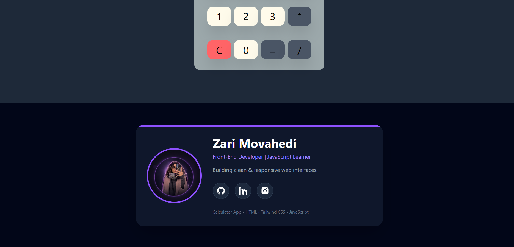

# 🧮 Calculator App

A simple and responsive Calculator built with **HTML**, **Tailwind CSS**, and **JavaScript**.

🔗 **Live Demo:**  
https://zarimovahedi-dev.github.io/calculator/

---

## 📸 Preview

### Calculator


### Footer



---

## ✨ Features

- Basic arithmetic operations
- Clean and modern UI
- Responsive design
- Interactive buttons
- Custom developer footer

---

## 🛠 Technologies

- HTML5
- Tailwind CSS
- JavaScript

---

## 🚀 Getting Started

```bash
git clone https://github.com/zarimovahedi-dev/calculator.git
```

Open `index.html` in your browser.

---

## 📂 Project Structure

```
calculator/
│
├── assets/
│   ├── images/
│   ├── stylesheet/
│   └── js/
│
├── index.html
└── README.md
```

---

## 👩‍💻 Developer

**Zari Movahedi**

Front-End Developer | JavaScript Learner

- GitHub: https://github.com/zarimovahedi-dev
- LinkedIn: https://www.linkedin.com/in/zari-movahedi-4b4224392
- Instagram: https://www.instagram.com/zarimovahedi_dev

---

⭐ If you like this project, don't forget to give it a star.# calculator
